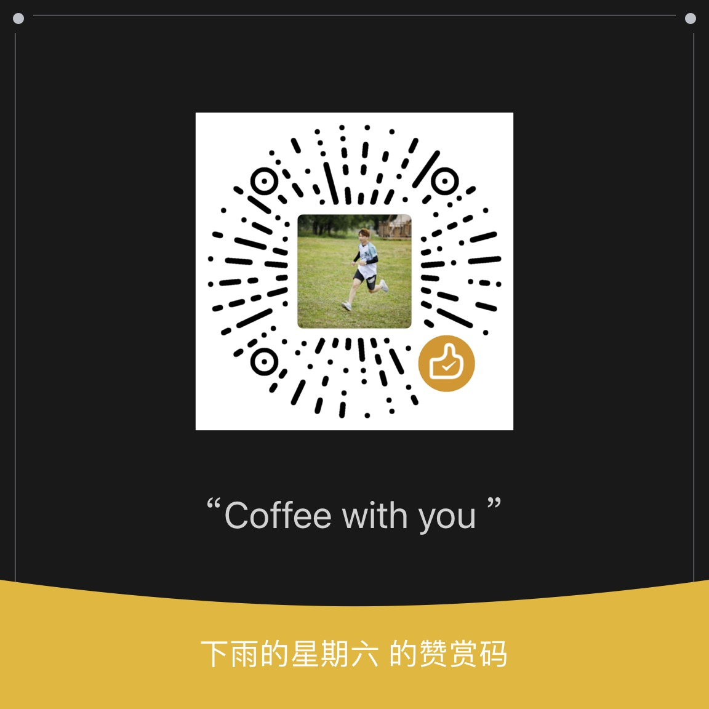

# ChattyAI
This project is a ChatGPT UI system that utilizes OpenAI to provide a chatbot service with user management, billing, and sensitive word filtering. The system has a simple and user-friendly interface and is cloud-based for secure and stable operation globally.

详细介绍见 [ChattyAI](https://ceks9foaej.feishu.cn/docx/Ksl3drMeroo2etxpalccf1JDnfe)

## 计划

- [ ] 语言计划
- [ ] accessToken 方式调用

## 如何部署

本项目分为 2 个前端和 1 个后端项目。

**其中 2 个前端项目：**

- @chattyai-web 用于给用户使用的前端项目，主要提供聊天使用，可以到对应的项目查看部署文档。
- @chattyai-web-ui 主要用于给管理员使用，提供一部分配置和管理功能。如果不想部署这部分，可以通过修改数据库实现这部分的功能

**任选一个后端项目部署**

有不同语言实现的后端 server，可以选择任意一个自己喜欢的语言部署

- chattyai-java
- chattyai-go
- chattyai-py

[详细部署文档](deploy.md)

# 相关项目

<table>
  <thead align="center">
    <tr border: none;>
      <td><b>🎁 Projects</b></td>
      <td><b>⭐ Stars</b></td>
      <td><b>📚 Forks</b></td>
      <td><b>🛎 Issues</b></td>
      <td><b>📬 Pull requests</b></td>
      <td><b>📬 Contributors</b></td>
      <td><b>📬 Gitee</b></td>
    </tr>
  </thead>
  <tbody>
    <tr>
      <td><a href="https://github.com/zhangyunan1994/ChattyAI"><b>ChattyAI</b></a></td>
      <td></td>
      <td></td>
      <td></td>
      <td></td>
      <td></td>
      <td><a href='https://gitee.com/zhangyunan1994/ChattyAI'></img></a></td>
    </tr>
    <tr>
      <td><a href="https://github.com/zhangyunan1994/chattyai-web"><b>chattyai-web</b></a></td>
      <td></td>
      <td></td>
      <td></td>
      <td></td>
      <td></td>
      <td><a href='https://gitee.com/zhangyunan1994/chattyai-web'></img></a></td>
    </tr>
    <tr>
      <td><a href="https://github.com/zhangyunan1994/chattyai-web-ui"><b>chattyai-web-ui</b></a></td>
      <td></td>
      <td></td>
      <td></td>
      <td></td>
      <td></td>
      <td><a href='https://gitee.com/zhangyunan1994/chattyai-web-ui'></img></a></td>
    </tr>
  </tbody>
</table>

## 参与贡献

感谢所有做过贡献的人!

## 赞助

如果你觉得这个项目对你有帮助，并且情况允许的话，可以给我一点点支持，总之非常感谢支持～

	

		
		
WeChat Pay

	

	

		
		
WeChat Pay

	

